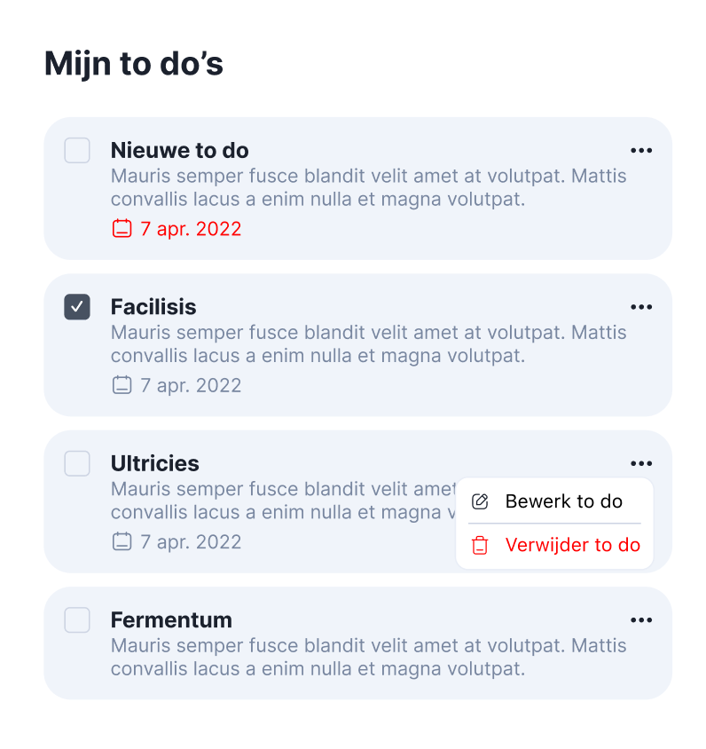

author: Wisemen
summary: Full Stack Onboarding Code Lab
id: index
tags:
categories:
environments:
status: Draft

# Wisemen Full Stack Onboarding

## Welcome to Wisemen 👋

  

### Welcome to the Full Stack onboarding!
Strap in and get ready to learn how we build killer apps at Wisemen 🔥.

In this onboarding you will build a complete feature **end-to-end**: you'll create your own backend API **and** the frontend that consumes it. No mock servers, no hosted playground backend — the frontend talks to **your own** API running on your machine.

#### You will learn how to work with
 - [Typescript](https://www.typescriptlang.org/docs/handbook/intro.html): Because a world without types is no world to live in
 - [Node.js](https://nodejs.org/en/learn/getting-started/introduction-to-nodejs): The engine of our backend applications
 - [NestJS](https://docs.nestjs.com/): A HTTP and dependency injection framework on top of Node.js with a lot of cats? 🐈‍⬛
 - [Vue 3](https://vuejs.org/) & [Vite](https://vite.dev/): Our frontend framework and build tool of choice
 - [Tailwind CSS](https://tailwindcss.com/): Utility-first styling
 - [TanStack Query](https://tanstack.com/query/latest/docs/framework/vue/overview): Fetching, caching and invalidating server state
 - [Zod](https://zod.dev/) & [Formango](https://github.com/wisemen-digital/vue-formango): Type-safe schemas and forms
 - Our `@wisemen/vue-core-*` libraries: [docs](https://vue-core.wisemen.digital/)
 - [TablePlus](https://docs.tableplus.com/): The database management tool with the best mascot 🐘 (we like elephant themed software)
 - [Typesense](https://typesense.org/): Our search engine
 - [NATS](https://nats.io/): Our event streaming backbone
 - [Figma](https://www.figma.com/): The tool our designers at Wisemen use to take our breath away 🎨
 - [Github](https://github.com/): Where we store our precious code
 - [Linear](https://linear.app/wisemen): Did you get any tickets yet? 🤨
 - And much more...

#### This onboarding is designed to be completed in roughly 4 to 5 days
People with more experience will be able to complete it faster than people with less experience.
Go at your own pace and be sure to ask for help when needed from your buddy or a member of our circle 🤝.

#### You will be working on a small to-do app 📋
This app will teach you our core conventions and ways of working in our full stack projects.
We expect you to make a **pull request** after every slice of work so your buddy can review your code and keep track of your progress 🫣.
Don't know how to make pull requests yet? No worries, more is explained [here](https://wisemen-digital.github.io/backend-playbook/development-environment/pull-requests).

Good luck!!!


## What you'll need 🛠️

Being a part of our team requires you to have ... well, Node.js 😅.
But to get Node.js we'll start by setting up your terminal and installing Homebrew 🍺, a popular package manager for MacOS.

Check our [backend Guidelines](https://wisemen-digital.github.io/backend-playbook/development-environment) for the tools you need to install before starting the onboarding.

- [Terminal Setup](https://wisemen-digital.github.io/backend-playbook/development-environment/terminal)
- [Package Manager](https://wisemen-digital.github.io/backend-playbook/development-environment/package-manager)
- [Node.js & TypeScript](https://wisemen-digital.github.io/backend-playbook/development-environment/node)
- [Docker](https://wisemen-digital.github.io/backend-playbook/development-environment/docker)
- [Git](https://wisemen-digital.github.io/backend-playbook/development-environment/git)
- [IDE](https://wisemen-digital.github.io/backend-playbook/development-environment/ide)
- [Figma](https://wisemen-digital.github.io/backend-playbook/development-environment/figma)

> aside positive
> The project template requires **Node.js v24** (check the `.nvmrc`) and **pnpm**. We use pnpm in all our projects — it's faster and more disk-space efficient than npm.

### Frontend extras for VS Code

Since you'll also be writing Vue, install these extensions on top of the backend setup:

- **Vue (Official / Volar)** — Vue language support
- **Tailwind CSS IntelliSense** — class name completion
- **i18n Ally** — managing translations
- **Error Lens** — inline errors
- **Vitest** — running tests from your editor

For the frontend way-of-working, our [frontend bible](https://wisemen-digital.github.io/frontend-bible/) is the place to be.

If you have any questions or need help with the setup, don't hesitate to ask your buddy or a member of our circle 🤝.

## What you'll build 📋

### Project requirements

You will be creating a full stack to-do app.
The app should allow the user to create, view, edit, delete, complete and uncomplete to-do's, and search through them.

### Designs

[Todo-app designs](https://www.figma.com/file/hebgv4Qx8VanMAQkO1NFpa/Onboarding-to-do?node-id=407-4095&t=2qdyy89lKwN7dFw3-0)

> aside positive
> Make sure you use the **"Web"** designs for the frontend part. Log in with your Wisemen Google account to view them.

 

_If there's one thing the world needs, it's more todo apps!_ 👍

### The game plan 🗺️

This onboarding works in **vertical slices**. For every feature you will:

1. Build the **backend use case** (entity, command, tests, use case, controller, module)
2. Run **`pnpm generate:api-client`** in the frontend — this regenerates a fully typed API client from *your* backend's OpenAPI spec
3. Build the **frontend feature** on top of the generated client

We'll repeat that loop four times, with less and less hand-holding:

1. **Create** a todo (BE ➡️ FE) — the deep dive, every file explained
2. **View** todos in a list, with search (BE ➡️ FE)
3. **Detail & update** a todo (BE ➡️ FE)
4. **Delete** a todo (BE ➡️ FE)
5. **Complete & uncomplete** a todo (BE ➡️ FE) — you're on your own here 😎

> 💡 Make a pull request after every slice. Small, frequent PRs are a core habit at Wisemen — your buddy will review each one.

## Project setup: create your project from the template

### Use the Wisemen project template

You can kickstart your new project without starting from square one by using the [Wisemen Project Template](https://github.com/wisemen-digital/wisemen-project-template). This is a **monorepo** that contains:

- `apps/api` — a NestJS backend with authentication, users, roles, permissions & much more already set up
- `apps/web` — a Vue 3 frontend with login, routing, a design system and an OpenAPI client generator already wired up
- `packages/*` — shared tooling (router helpers, i18n, lint configs)

Go to [wisemen-digital/wisemen-project-template](https://github.com/wisemen-digital/wisemen-project-template) and click the **"Use this template"** button to create a new repository under your own GitHub account. Name it something like `onboarding-todo`.

> aside positive
> If at any point you are stuck, take a peek at the **contact module** — it exists on both sides of the stack (`apps/api/src/app/contact` and `apps/web/src/modules/contact`) and is the canonical example for everything you will build in this onboarding.

### Monorepo tooling

The repository uses [Turborepo](https://turborepo.com/) and [pnpm workspaces](https://pnpm.io/workspaces). You'll mostly notice this when running scripts: some commands run for a single app (from inside `apps/api` or `apps/web`), others run from the repository root and orchestrate multiple apps at once.

## Project setup: environment variables

### Backend

Copy `.env.test` to `.env` inside `apps/api`:

```bash
cd apps/api
cp .env.test .env
```

The interesting part of this file is the auth section. Our backend does not issue tokens itself — it validates JWTs issued by **Zitadel**, our identity provider. Locally we point at the shared internal Zitadel instance:

```env
AUTH_JWKS_ENDPOINT=https://zitadel.internal.appwi.se/oauth/v2/keys
AUTH_ISSUER=https://zitadel.internal.appwi.se
AUTH_PROJECT_ID=284257737964130471
```

### Frontend

Create a `.env` file in `apps/web` (you can start from `.env.example`):

```env
API_BASE_URL=http://localhost:3000

AUTH_BASE_URL=https://zitadel.internal.appwi.se
AUTH_CLIENT_ID=305078631263175721
AUTH_ORGANIZATION_ID=284257737964064935

ENVIRONMENT=local
```

`API_BASE_URL` points at **your own backend** — that's the whole point of this onboarding 😉. The `AUTH_*` variables make the prebuilt login page talk to Zitadel.

> aside negative
> Double-check the `AUTH_CLIENT_ID`, `AUTH_ORGANIZATION_ID` and `AUTH_PROJECT_ID` values with your buddy — they must point at the **onboarding** Zitadel application, and your Wisemen account must be a member of that organization. If logging in fails later on, this is the first place to look.

## Project setup: start the stack 🚀

### 1. Start the services with Docker

To run the services required for the project, we use Docker. Start them by running the following command in the repository root:

```bash
docker compose up
```

#### Services

- **postgres**: The PostgreSQL (PostGIS) database for the project.
- **zitadel**: A local OIDC authentication service (we point at the shared internal Zitadel instead, so you can disable this one).
- **typesense** + **typesense_dashboard**: The search engine for the project, and a dashboard to debug it locally.
- **nats**: The message broker for the project.
- **redis**: Caching.
- **s3service**: An S3-compatible local object store called minio.
- **go-feature-flag**: A feature flag service.
- **mailpit**: A local mail catcher — every mail the API sends shows up at [http://localhost:8025](http://localhost:8025).

> As a sidenote, you might want to disable zitadel and go-feature-flag locally unless you really want to test those services specifically.

### 2. Install dependencies

```bash
pnpm install
```

### 3. Run the project

From the repository root:

```bash
pnpm dev
```

Turborepo starts both apps in parallel:

- The API on [http://localhost:3000](http://localhost:3000) — check the Swagger docs at [http://localhost:3000/api/docs](http://localhost:3000/api/docs)
- The web app on [http://localhost:5173](http://localhost:5173)

You can also run a single app by running `pnpm dev` inside `apps/api` or `apps/web`.

> 💡 Database migrations run automatically when the API boots.

## TablePlus Setup
### Connecting with PostgreSQL

Open TablePlus, click on 'create new connection' and select PostgreSQL. <br />
Name: `Todo App` <br />
Host/Socket : `localhost` <br />
Port: `5432` <br />
User: `postgres` <br />
Password: `password` <br />
Database: `test_db`<br />

## Architecture & Conventions

Backend projects in Nest.js have come a long way at Wisemen and have had multiple architectural changes. If at any point you are interested in which architectural choices we made and why, be sure to ask your buddy. (This might be on the test later 🥸).

Briefly summarized, we apply a layered architecture which can be simplified to the following layers:
- **controller, job handler, event listener**: responsible for in and outgoing communication
- **application layer**: orchestrates the business logic, typically use cases
- **storage layer**: typically database interaction code

We apply a **vertical slice architecture** to split code into isolated business use cases. That's why you'll find that every use case has its own layered set of classes.

### Backend folder structure

Feature modules live in `apps/api/src/app/`. Infrastructure modules (auth, permissions, typesense, nats, ...) live in `apps/api/src/modules/` — you'll plug into those, but your feature code goes in `src/app`.

```
- apps/api/src
   |__ 📁 app
   |   |__ 📁 contact
   |   |   |__ 📁 entities
   |   |   |   |__ 📄 contact.entity.ts
   |   |   |   |__ 📄 contact.entity.builder.ts
   |   |   |   |__ 📄 contact.uuid.ts
   |   |   |
   |   |   |__ 📁 events
   |   |   |__ 📁 errors
   |   |   |__ 📁 typesense
   |   |   |__ 📁 use-cases
   |   |   |   |__ 📁 create-contact
   |   |   |   |   |__ 📁 integration
   |   |   |   |   |__ 📁 tests
   |   |   |   |   |__ 📄 create-contact.command.ts
   |   |   |   |   |__ 📄 create-contact.command.builder.ts
   |   |   |   |   |__ 📄 create-contact.controller.ts
   |   |   |   |   |__ 📄 create-contact.module.ts
   |   |   |   |   |__ 📄 create-contact.repository.ts
   |   |   |   |   |__ 📄 create-contact.response.ts
   |   |   |   |   |__ 📄 create-contact.use-case.ts
   |   |   |   |   |__ 📄 contact-created.event.ts
   |   |   |   |
   |   |   |   |__ 📁 update-contact
   |   |   |   |__ 📁 ...
   |   |   |
   |   |   |__ 📄 contact.module.ts
   |   |
   |   |__ 📁 users
   |   |__ 📁 ...
   |
   |__ 📁 modules (infrastructure)
   |__ 📁 sql/migrations
```

### Frontend folder structure

The frontend mirrors this modular thinking. Feature modules live in `apps/web/src/modules/`:

```
- apps/web/src
   |__ 📁 modules
   |   |__ 📁 contact
   |   |   |__ 📁 api
   |   |   |   |__ 📄 contact.service.ts
   |   |   |   |__ 📄 contact.queryKeys.ts
   |   |   |   |__ 📁 queries
   |   |   |   |__ 📁 mutations
   |   |   |
   |   |   |__ 📁 models
   |   |   |   |__ 📁 contact
   |   |   |       |__ 📄 contactUuid.model.ts
   |   |   |       |__ 📁 create   (form model + transformer)
   |   |   |       |__ 📁 index   (model + query params + transformers)
   |   |   |       |__ 📁 detail  (model + transformer)
   |   |   |       |__ 📁 update  (form model + transformer)
   |   |   |
   |   |   |__ 📁 use-cases
   |   |   |   |__ 📁 overview (views, components, composables)
   |   |   |   |__ 📁 create   (views)
   |   |   |   |__ 📁 update   (views)
   |   |   |
   |   |   |__ 📁 actions
   |   |   |__ 📄 contact.routes.ts
   |   |   |__ 📄 index.ts
   |   |
   |   |__ 📁 ...
   |
   |__ 📁 client (generated — never edit!)
   |__ 📁 routes
   |__ 📁 types
   |__ 📁 locales
```

### Project structure


### File naming conventions
On the backend we use **kebab-case** for filenames and folders, named by purpose and type: `create-contact.command.ts`.
On the frontend we use **camelCase** with a type suffix: `contactCreateForm.model.ts`, `contactIndex.query.ts`, and PascalCase for components: `ContactOverviewView.vue`.

## Code Quality & Linting

### Why a hybrid linting system?

We use a **hybrid linting setup** that combines [OXC](https://oxc.rs/) and [ESLint](https://eslint.org/). Here's why:

- **OXC** is a blazing-fast Rust-based linter. It runs significantly faster than ESLint and covers a large and growing set of lint rules out of the box.
- **ESLint** is slower but has a rich ecosystem of plugins that cover rules OXC does not (yet) support.

Rather than running ESLint for everything — which is slow — we only enable ESLint rules that have **no OXC equivalent**. This gives us the best of both worlds: the speed of OXC for the majority of checks, and the completeness of ESLint for the rest.

Run the linters with `pnpm lint` (check) or `pnpm lint:fix` (fix) inside either app.

### VS Code Setup

To make both linters and the formatter work correctly in VS Code, you need the following extensions installed:

- **[OXC](https://marketplace.visualstudio.com/items?itemName=oxc.oxc-vscode)** — Fast linter powered by OXC
- **[ESLint](https://marketplace.visualstudio.com/items?itemName=dbaeumer.vscode-eslint)** — ESLint integration for VS Code
- **[oxfmt](https://marketplace.visualstudio.com/items?itemName=YoavCohen.oxfmt)** — Formatter backed by OXC

> Make sure all three extensions are enabled in your workspace.

Additionally, add the following setting to your VS Code user or workspace settings (`settings.json`) to ensure imports are always generated as non-relative paths:

```json
{
  "js/ts.preferences.importModuleSpecifier": "non-relative",
  "editor.defaultFormatter": "oxc.oxc-vscode",
  "[typescript]": {
    "editor.defaultFormatter": "oxc.oxc-vscode",
  },
  "[javascript]": {
    "editor.defaultFormatter": "oxc.oxc-vscode",
  },
  "[json]": {
    "editor.defaultFormatter": "oxc.oxc-vscode",
  },
  "editor.codeActionsOnSave": {
    "source.fixAll.eslint": "explicit",
    "source.fixAll.oxc": "explicit",
  },
  "oxc.enable.oxfmt": true,
  "oxc.enable": true,
}
```

This ensures that auto-imported paths follow our module alias convention instead of generating fragile relative paths like `../../modules/...`.

## PART 1: The Todo backend
The goal is to create a robust backend system that allows users to perform CRUD operations on todo items.

### Project Description
The app should support the following use cases:

- **Create a Todo**: Users can create a new todo item with a title, description, and deadline.
- **View all Todos**: Users can retrieve and search a list of all todo items of the authenticated user.
- **View the detail of a Todo**: Users can retrieve a specific todo item by its unique identifier.
- **Update a Todo**: Users can update the title, description, and deadline of a todo item.
- **Delete a Todo**: Users can delete a todo item by its unique identifier.
- **Complete a Todo**: Users can mark a todo item as completed.
- **Uncomplete a Todo**: Users can mark a completed todo item as uncompleted.
- **Update external systems**: Other systems can subscribe to integration events emitted by our application.

### Naming conventions

1. **Entity**: Defines the structure of a database table, like a Todo item.

2. **Command, Queries and Response**: Commands and Queries are used to define the data structure of the input. Responses are used to define the data structure of the output. In case of a HTTP API, a command is the body of the request. A query is the query of the HTTP request and a response is the body of the response.

3. **Controller**: A controller handles incoming HTTP requests.

4. **Module**: Organizes the components into a module to encapsulate related functionality. A module is a dependency injection concept from Nest.js — it defines imports, providers and exports of the module.

5. **Use case**: The application layer that orchestrates business logic. For simple use cases the business logic is entirely contained within the use case itself.

6. **Repository**: The repository abstracts database interactions.

7. **Domain Event**: An internal transaction-scoped event that communicates changes between different modules that live inside the same application.

8. **Integration Event**: An event that is emitted externally to communicate with other systems.

Now, let's dive into building the Todo App Backend!

## Todo Entity

Entities are used to define the data structure for a todo item. In this project, you will define a Todo entity.

### Entity Definition

The Todo entity is a simple data structure that represents a todo item. It should include the following fields:

- **uuid**: A unique identifier for the todo item.
- **createdAt**: An auto generated timestamp used for debugging.
- **updatedAt**: An auto generated timestamp used for debugging.
- **deletedAt**: A nullable timestamp used for soft deletes.
- **title**: The title of the todo item.
- **description**: An optional description for the todo item.
- **deadline**: An optional deadline for the todo item.
- **completed**: A boolean value indicating whether the todo item is completed.

To view all possible column types using TypeORM with PostgreSQL, see the [docs](https://orkhan.gitbook.io/typeorm/docs/entities#column-types).

### Branded uuids

We always brand uuids into a separate type like `TodoUuid` so that you cannot accidentally pass the wrong type of uuid around. Create `apps/api/src/app/todo/entities/todo.uuid.ts`:

```typescript
// todo.uuid.ts
import type { Uuid } from '#src/utils/types/uuid.js'

export type TodoUuid = Uuid<'Todo'>
```

### Entity Setup
To define the Todo entity, create a new file called `todo.entity.ts` in the `apps/api/src/app/todo/entities` folder and define the Todo class.

```typescript
// todo.entity.ts
import { Column, CreateDateColumn, DeleteDateColumn, Entity, PrimaryGeneratedColumn, UpdateDateColumn } from 'typeorm'
import type { TodoUuid } from './todo.uuid.js'

@Entity()
export class Todo {
  @PrimaryGeneratedColumn('uuid')
  uuid: TodoUuid

  @CreateDateColumn({ precision: 3 })
  createdAt: Date

  @UpdateDateColumn({ precision: 3 })
  updatedAt: Date

  @DeleteDateColumn({ precision: 3, nullable: true })
  deletedAt: Date | null

  @Column({ type: 'varchar' })
  title: string

  // ... add description (nullable varchar), deadline (nullable timestamptz) and completed (boolean, default false) yourself
}
```

> 💡 For the sake of exercise, typing the code yourself throughout this onboarding will help with remembering it better than copying the code.

### Entity Relations
Until now the Todo entity had no relation with any other entities. We want to add a relation on todo to track the owner of the todo (a user). To create a relation between the Todo and User entities, you can use the `@ManyToOne` decorator to define a many-to-one relationship between the two entities.

Here the Todo is the owner of the relationship. There can be many Todo's per User but each Todo only has a single User.

```typescript
// apps/api/src/app/todo/entities/todo.entity.ts

import { Column, CreateDateColumn, DeleteDateColumn, Entity, Index, JoinColumn, ManyToOne, PrimaryGeneratedColumn, type Relation, UpdateDateColumn } from 'typeorm'
import type { TodoUuid } from './todo.uuid.js'
import { User } from '#src/app/users/entities/user.entity.js'
import type { UserUuid } from '#src/app/users/entities/user.uuid.js'

@Entity()
export class Todo {
  // ... other fields

  @Index()
  @Column({ type: 'uuid' })
  userUuid: UserUuid

  @ManyToOne(() => User)
  @JoinColumn({ name: 'user_uuid' })
  user?: Relation<User>
}
```

This code already contains some of our conventions that we choose to uphold but are not required by TypeORM itself.
- We always brand uuids into a separate type like `UserUuid` so that you cannot accidentally pass the wrong type of uuid.
- `@JoinColumn({ name: 'user_uuid' })` contains the name of the column TypeORM will use for joins, we default to snake_case.
- `user?: Relation<User>` we define relations as optional (`?:`) because they have to be joined explicitly. Meaning that they will not always be present on an object with the Todo type.
- `@Index()` we put an index on the `userUuid` column. It is generally good practice to index the foreign key column to improve lookups and joins. If you want to learn more about indexes check out this awesome [site](https://use-the-index-luke.com/).

### The entity builder

Throughout the project we construct entities with the **builder pattern**. Create `todo.entity.builder.ts` next to the entity. Peek at `contact.entity.builder.ts` for the pattern — the constructor sets sane defaults, and every field gets a `with...` method:

```typescript
// todo.entity.builder.ts
import { Todo } from './todo.entity.js'
import type { TodoUuid } from './todo.uuid.js'
import type { UserUuid } from '#src/app/users/entities/user.uuid.js'
import { generateUuid } from '#src/utils/types/uuid.js'

export class TodoBuilder {
  private readonly todo: Todo

  constructor () {
    this.todo = new Todo()
    this.todo.uuid = generateUuid()
    this.todo.createdAt = new Date()
    this.todo.updatedAt = new Date()
    this.todo.title = 'todo'
    this.todo.description = null
    this.todo.deadline = null
    this.todo.completed = false
    this.todo.userUuid = generateUuid<UserUuid>()
  }

  withUuid (uuid: TodoUuid): this {
    this.todo.uuid = uuid
    return this
  }

  // ... add withTitle, withDescription, withDeadline, withCompleted, withUserUuid yourself

  build (): Todo {
    return this.todo
  }
}
```

### Create migration

After defining the Todo entity, we need to create a migration to apply the changes to the database schema.
Run the following command in your terminal:

```bash
# in apps/api

pnpm typeorm migration:generate src/sql/migrations/create-todo-table
```

**Be sure to always check the generated migration and see if there are no unexpected changes.**

### Apply migration

After generating the migration file, you need to apply the migration to update the database schema.

```bash
# in apps/api

pnpm typeorm migration:run
```

Check TablePlus — you should see your new `todo` table 🎉.

> 💡 This is a great point to create your first pull request so your buddy can review your code and keep track of your progress. Keeping your PR's small and frequent is a good practice.

## Create Todo: Command and Response

Now we'll start to create the first use case. Add a `use-cases/create-todo` folder next to the `entities` folder from earlier.

### Command
Commands define how the input of a use case is structured. We define which fields are required and basic input validation for each field. First we will create a command for creating a todo item. Add the command in the `create-todo` use-case folder.

```typescript
// create-todo.command.ts

import { IsDateString, IsNotEmpty, IsString } from 'class-validator'
import { IsNullable } from '@wisemen/validators'

export class CreateTodoCommand {
  @IsString()
  @IsNotEmpty()
  title: string

  // ... do the description yourself
  description: string | null

  @IsNullable()
  @IsDateString({ strict: true })
  deadline: string | null
}
```

To view all possible decorators using class-validator, see the [docs](https://github.com/typestack/class-validator). Next to the validators from class-validator, we have also implemented custom validators in [@wisemen/validators](https://www.npmjs.com/package/@wisemen/validators), like `@IsNullable()` which you see here.

### Response
Responses define the data structure for the output of a use case. The response transforms the data into the correct format before sending it to the frontend.

Create a new file called `create-todo.response.ts` in the `create-todo` use case folder and define the CreateTodoResponse class:

```typescript
// create-todo.response.ts
import { Todo } from '#src/app/todo/entities/todo.entity.js'
import type { TodoUuid } from '#src/app/todo/entities/todo.uuid.js'

export class CreateTodoResponse {
  uuid: TodoUuid

  constructor (todo: Todo) {
    this.uuid = todo.uuid
  }
}
```

We only return the necessary data in the response. In this case, we only need the uuid.

On updates and deletes, we generally return no data, only a status code 204.

### Documentation
We have created both the input and output of our use case and added validation on the input. In order to document the input and output **for the frontend** we need to generate some form of documentation. In Nest.js this is achieved with the `@ApiProperty` decorator. It attaches metadata to the command and response so an OpenAPI spec can be generated.

This documentation is extra important in this onboarding: **the frontend client you'll generate later is only as good as the OpenAPI spec you describe here**. A missing `@ApiProperty` means a missing field in your generated types!

Edit `create-todo.command.ts` and add the `@ApiProperty` decorator to all the properties:

```typescript
// create-todo.command.ts
import { ApiProperty } from '@nestjs/swagger'

export class CreateTodoCommand {
  @ApiProperty({ type: String, example: 'Finish the onboarding' })
  @IsString()
  @IsNotEmpty()
  title: string

  // ... do the description yourself
  description: string | null

  @ApiProperty({ type: String, format: 'date-time', nullable: true })
  @IsNullable()
  @IsDateString({ strict: true })
  deadline: string | null
}
```

Don't forget to add the `@ApiProperty` decorators to the response as well.

> 💡 If at any point you feel stuck or are unsure about how something works, be sure to ask your buddy.

## Create Todo: E2E tests first
### Testing

At Wisemen we require automated tests for every feature and reusable component. For use cases we typically define end-to-end tests, integration tests and unit tests. We decide which types of tests we need based on the complexity of the feature and code. In general the following rules apply:

- We create an end-to-end test for every use case with a controller (i.e. it's a HTTP endpoint).
- We create a unit test for every use case that has some meaningful side effect (e.g. creating, updating an entity).
- We create integration tests for all generally more difficult behavior so we can isolate it. Some examples could be integration testing difficult queries in repositories or testing that an async job works as expected.

In general we have no hard requirements on whether you should write tests before or after you write your code. But for this onboarding we will define the tests first.

### E2E Testing
End-to-end (E2E) testing is a software testing method that tests the entire software application from start to finish. The purpose of E2E testing is to simulate real user scenarios and validate the system's integration with external interfaces.

Create a new file called `create-todo.e2e.test.ts` in a `tests` folder inside the use case folder.

```typescript
// tests/create-todo.e2e.test.ts

import { after, before, describe, it } from 'node:test'
import request from 'supertest'
import { expect } from 'expect'
import type { TestSetup } from '#test/setup/test-setup.js'
import { TestBench } from '#test/setup/test-bench.js'

describe('Create todo e2e tests', () => {
  let setup: TestSetup

  before(async () => {
    setup = await TestBench.setupEndToEndTest()
  })

  after(async () => {
    await setup.teardown()
  })
})
```

In the above code, you defined the create todo test with the `before` and `after` hooks to set up and tear down the application for the tests.
Every end-to-end test file runs in its own transaction in order to prevent other tests from influencing its setup.

Note the import aliases: `#test/...` and `#src/...`. We never write long relative paths like `../../../../test/...` — remember the VS Code setting from the linting chapter?

Because we will be creating a todo as a user, let's add test users:

```typescript
import type { TestUser } from '#src/app/users/tests/setup-user.type.js'
import { Permission } from '#src/modules/permission/permission.enum.js'

describe('Create todo e2e tests', () => {
  let setup: TestSetup
  let user: TestUser
  let unauthorizedUser: TestUser

  before(async () => {
    setup = await TestBench.setupEndToEndTest()
    user = await setup.authContext.getUser([Permission.TODO_CREATE]) // You will add this permission to the Permission enum in the next step
    unauthorizedUser = await setup.authContext.getUser([]) // This user has no permissions
  })

  after(async () => {
    await setup.teardown()
  })
})
```

Now you need to add the tests for the create operation. In our tests we will check the following cases:

- **Unauthenticated**: Test the API endpoint without authentication.
- **Unauthorized**: Test the API endpoint with an unauthorized user.
- **Invalid Input**: Test the API endpoint with invalid input data.
- **Valid Input**: Test the API endpoint with valid input data.

```typescript
// tests/create-todo.e2e.test.ts
describe('Create todo e2e tests', () => {
  // ... setup

  it('blocks calls without authentication', async () => {
    const response = await request(setup.httpServer)
      .post('/api/v1/todos')

    expect(response).toHaveStatus(401)
  })

  it('blocks unauthorized users', async () => {
    const response = await request(setup.httpServer)
      .post('/api/v1/todos')
      .set('Authorization', `Bearer ${unauthorizedUser.token}`)
      .send({})

    expect(response).toHaveStatus(403)
  })

  it('validates the command', async () => {
    const response = await request(setup.httpServer)
      .post('/api/v1/todos')
      .set('Authorization', `Bearer ${user.token}`)
      .send({})

    expect(response).toHaveStatus(400)
  })

  it('creates a todo', async () => {
    const command = new CreateTodoCommandBuilder()
      .withTitle('Test Todo')
      .withDescription('Test Description')
      .build()

    const response = await request(setup.httpServer)
      .post('/api/v1/todos')
      .set('Authorization', `Bearer ${user.token}`)
      .send(command)

    expect(response).toHaveStatus(201)
    expect(response.body).toStrictEqual(expect.objectContaining({
      uuid: expect.uuid()
    }))
  })
})
```

Some things to note:
- The app runs on **Fastify** — `setup.httpServer` gives you the raw HTTP server to fire requests at with supertest.
- `toHaveStatus` and `expect.uuid()` are custom matchers from our test bench. They give much nicer error output than asserting on `response.status` directly.
- We use a builder to create the command. The `CreateTodoCommandBuilder` is up next!

## Create Todo: Builders

Builders are used to create data objects for tests (and for entities in use cases, as you saw with the `TodoBuilder`). You will define a `CreateTodoCommandBuilder` to create commands for the tests.

Create a new file called `create-todo.command.builder.ts` **in the use-case folder itself** (next to the command — not in the `tests` folder, the use case itself will profit from it too):

```typescript
// create-todo.command.builder.ts
import { CreateTodoCommand } from './create-todo.command.js'

export class CreateTodoCommandBuilder {
  private command: CreateTodoCommand

  constructor () {
    // We define "sane" defaults
    this.command = new CreateTodoCommand()
    this.command.title = 'Onboard our new colleague'
    this.command.description = null
    this.command.deadline = null
  }

  withTitle (title: string): this {
    this.command.title = title
    return this
  }

  withDescription (description: string | null): this {
    this.command.description = description
    return this
  }

  withDeadline (deadline: string | null): this {
    this.command.deadline = deadline
    return this
  }

  build (): CreateTodoCommand {
    return this.command
  }
}
```

### Permissions

Our endpoints are guarded by permissions. Add the Todo permissions to the `Permission` enum in `apps/api/src/modules/permission/permission.enum.ts` (have a look at how the contact permissions are defined):

```typescript
TODO_CREATE = 'todo.create',
TODO_READ = 'todo.read',
TODO_UPDATE = 'todo.update',
TODO_DELETE = 'todo.delete',
```

### Running tests

Have a look at the `.env.test` file — this environment file is used when running the tests. Make sure your docker containers are running.

Now run the tests:

```bash
# in apps/api

pnpm test:all
```

You will see your new tests fail because we haven't implemented anything yet. That's exactly what we want at this point 🔴.

> 💡 You can run a single test file with `pnpm test:one dist/src/app/todo/use-cases/create-todo/tests/create-todo.e2e.test.js`

## Create Todo: Use Case and Repository
### Domain event

When a todo gets created, other parts of the application might want to react to that. We communicate this through **domain events**. First create a base event type for the todo module in `apps/api/src/app/todo/events/todo-event.ts` — peek at `contact-event.ts` for the pattern:

```typescript
// events/todo-event.ts
import type { SubjectedEventOptions } from '#src/modules/domain-events/domain-event.js'
import { DomainEvent } from '#src/modules/domain-events/domain-event.js'
import { DomainEventSubjectType } from '#src/modules/domain-events/domain-event-subject-type.enum.js'
import type { TodoUuid } from '#src/app/todo/entities/todo.uuid.js'

export class TodoEvent<Content extends object> extends DomainEvent<Content> {
  constructor (options: SubjectedEventOptions<Content, { todoUuid: TodoUuid }>) {
    super({
      ...options,
      subjectId: options.todoUuid,
      subjectType: DomainEventSubjectType.TODO
    })
  }
}
```

You'll need to add `TODO = 'todo'` to the `DomainEventSubjectType` enum, and a `TODO_CREATED = 'todo.created'` entry to the `DomainEventType` enum (`apps/api/src/modules/domain-events/`).

Then create the specific event in the use-case folder:

```typescript
// todo-created.event.ts
import { DomainEventType } from '#src/modules/domain-events/domain-event-type.js'
import { RegisterDomainEvent } from '#src/modules/domain-events/register-domain-event.decorator.js'
import { Todo } from '#src/app/todo/entities/todo.entity.js'
import { TodoEvent } from '#src/app/todo/events/todo-event.js'
import type { TodoUuid } from '#src/app/todo/entities/todo.uuid.js'

export class TodoCreatedEventContent {
  constructor (readonly uuid: TodoUuid) {}
}

@RegisterDomainEvent(DomainEventType.TODO_CREATED, 1)
export class TodoCreatedEvent extends TodoEvent<TodoCreatedEventContent> {
  constructor (todo: Todo) {
    super({
      todoUuid: todo.uuid,
      content: new TodoCreatedEventContent(todo.uuid)
    })
  }
}
```

### Use Case

Use cases orchestrate the business logic of the application. The creation of a todo, admittedly, does not have a lot of business logic.

Create a new file called `create-todo.use-case.ts` in the use case folder:

```typescript
// create-todo.use-case.ts
import { DataSource } from 'typeorm'
import { transaction } from '@wisemen/nestjs-typeorm'
import { Injectable } from '@nestjs/common'
import { CreateTodoCommand } from './create-todo.command.js'
import { CreateTodoResponse } from './create-todo.response.js'
import { TodoCreatedEvent } from './todo-created.event.js'
import { CreateTodoRepository } from './create-todo.repository.js'
import { TodoBuilder } from '#src/app/todo/entities/todo.entity.builder.js'
import { DomainEventEmitter } from '#src/modules/domain-events/domain-event-emitter.js'
import type { UserUuid } from '#src/app/users/entities/user.uuid.js'

@Injectable()
export class CreateTodoUseCase {
  constructor (
    private readonly datasource: DataSource,
    private readonly eventEmitter: DomainEventEmitter,
    private readonly repository: CreateTodoRepository
  ) {}

  public async execute (command: CreateTodoCommand, userUuid: UserUuid): Promise<CreateTodoResponse> {
    const todo = new TodoBuilder()
      .withUserUuid(userUuid)
      .withTitle(command.title)
      .withDescription(command.description)
      .withDeadline(command.deadline !== null ? new Date(command.deadline) : null)
      .build()

    const event = new TodoCreatedEvent(todo)

    await transaction(this.datasource, async () => {
      await this.repository.insert(todo)
      await this.eventEmitter.emit([event])
    })

    return new CreateTodoResponse(todo)
  }
}
```

Let's go through some of the code:
1. The use case is decorated with `@Injectable()`, this means that any constructor arguments will be injected by Nest.js during bootstrap.
2. The constructor defines 3 dependencies:
   * `datasource` represents the connection to the database and is used to start a transaction
   * `eventEmitter` emits events to interested listeners within the application
   * `repository` abstracts the database code so we can simplify unit testing the use case
3. We insert the todo and emit the event **in the same transaction**. Listeners of the event could perform their own database operations and we want to make sure that we apply an all-or-nothing policy when creating a todo.

### Repository

The repository abstracts the actual database interaction:

```typescript
// create-todo.repository.ts
import { InjectRepository } from '@wisemen/nestjs-typeorm'
import { Repository } from 'typeorm'
import { Todo } from '#src/app/todo/entities/todo.entity.js'

export class CreateTodoRepository {
  constructor (
    @InjectRepository(Todo) private readonly todoRepo: Repository<Todo>
  ) {}

  async insert (todo: Todo): Promise<void> {
    await this.todoRepo.insert(todo)
  }
}
```

Note that `@InjectRepository` comes from `@wisemen/nestjs-typeorm`, not from `@nestjs/typeorm`.

> 💡 Do you understand everything here? If not, first try to find out by yourself what is going on. The `create-contact` use case is your best friend. But don't be shy to ask your buddy if you feel like you're stuck.

## Create Todo: Controller
### Controller

Controllers handle incoming HTTP calls. We create a separate controller for every use case.

### Controller Definition
Create a new file called `create-todo.controller.ts` in the `create-todo` use case folder and define the `CreateTodoController` class:

```typescript
// create-todo.controller.ts

import { Body, Controller, Post, Version } from '@nestjs/common'
import { ApiCreatedResponse, ApiOAuth2, ApiTags } from '@nestjs/swagger'
import { CreateTodoCommand } from './create-todo.command.js'
import { CreateTodoResponse } from './create-todo.response.js'
import { CreateTodoUseCase } from './create-todo.use-case.js'
import { Permission } from '#src/modules/permission/permission.enum.js'
import { Permissions } from '#src/modules/permission/permission.decorator.js'
import { AuthContext } from '#src/modules/auth/auth.context.js'

@ApiTags('Todo')
@ApiOAuth2([])
@Controller()
export class CreateTodoController {
  constructor (
    private readonly useCase: CreateTodoUseCase,
    private readonly authContext: AuthContext
  ) { }

  @Post('todos')
  @Version('1')
  @Permissions(Permission.TODO_CREATE)
  @ApiCreatedResponse({ type: CreateTodoResponse })
  public async createTodo (
    @Body() command: CreateTodoCommand
  ): Promise<CreateTodoResponse> {
    const userUuid = this.authContext.getUserUuidOrFail()

    return this.useCase.execute(command, userUuid)
  }
}
```

In the code above, you implement the controller class with the `createTodo` method to handle the create operation for the todo items. We injected our use case into the controller and used the `execute` method to create a new todo item with the specified data.

- The `@Controller()` decorator tells Nest.js that this class contains a HTTP endpoint.
- The `@Post('todos')` decorator defines a HTTP POST endpoint. Combined with the global `api` prefix and the version below, the full path becomes `/api/v1/todos`.
- The `@Version('1')` decorator defines this endpoint as `v1`.
- The `@Permissions(...)` decorator validates that only users with the specified permission can call this endpoint.
- The `@ApiCreatedResponse(...)` decorator defines the response schema for the OpenAPI documentation.
- The `@Body()` decorator validates the request body against the `CreateTodoCommand` class.
- The `AuthContext` is a class that's aware of the user who is performing the API call. We use `getUserUuidOrFail()` to fetch the `UserUuid` of the authenticated user and pass it into the use case — that's how each todo gets its owner.

Also see the [NestJS documentation](https://docs.nestjs.com/controllers) for more information about controllers.

### Identity Access Management and Access Control

We prevent unauthenticated users from accessing the endpoints of our API. In our project template, we already implemented the middleware that guards our endpoints. Have a look at `auth.middleware.ts` and `auth.module.ts` in `apps/api/src/modules/auth` — all endpoints are protected by default.

Furthermore, have a look at the auth and user modules, where all the authentication and user management logic is implemented.

For most projects, we use **Zitadel** as our identity provider (i.e. the issuer of access tokens). Our middleware only checks if the user has a valid token and if the user is allowed to access the endpoint.

## Create Todo: Tying it all together with Modules
### Module

Modules organize the dependency injection and bootstrapping system of Nest.js. We create a module for every use case, and one parent module per feature.

### Module Definition

Create a new file called `create-todo.module.ts` in the `create-todo` use case folder:

```typescript
// create-todo.module.ts
import { Module } from '@nestjs/common'
import { TypeOrmModule } from '@wisemen/nestjs-typeorm'
import { CreateTodoController } from './create-todo.controller.js'
import { CreateTodoUseCase } from './create-todo.use-case.js'
import { CreateTodoRepository } from './create-todo.repository.js'
import { Todo } from '#src/app/todo/entities/todo.entity.js'

@Module({
  imports: [TypeOrmModule.forFeature([Todo])],
  controllers: [CreateTodoController],
  providers: [
    CreateTodoUseCase,
    CreateTodoRepository
  ]
})
export class CreateTodoModule {}
```

- The `imports` property defines the dependencies of this module.
- The `controllers` property registers the `CreateTodoController`.
- The `providers` define injectable components that are scoped to this module.

Also see the [NestJS documentation](https://docs.nestjs.com/modules) for more information about modules.

### The Todo feature module

After defining the `CreateTodoModule`, create a `todo.module.ts` file in the todo folder that imports the CreateTodoModule (have a look at `contact.module.ts`):

```typescript
// apps/api/src/app/todo/todo.module.ts
import { Module } from '@nestjs/common'
import { CreateTodoModule } from './use-cases/create-todo/create-todo.module.js'

@Module({
  imports: [
    CreateTodoModule
  ]
})
export class TodoModule { }
```

Finally, the `TodoModule` needs to be registered in the API module to make it available in the application. That happens in `apps/api/src/modules/api/api.module.ts` — add `TodoModule` to the `imports` array, right next to `ContactModule`.

### Try it out

When you run the application (`pnpm dev`), the TodoModule will be loaded and the `CreateTodoController` will be available to handle API requests. You can find the generated documentation in the [Swagger UI](http://localhost:3000/api/docs) — your `POST /api/v1/todos` endpoint should be right there 🎉.

### Testing
At this point you can run the tests again with `pnpm test:all` to see if everything is working as expected. If the tests are passing, you can continue to the next step. 🟢

> 💡 Don't forget to make a pull request of your work so your buddy can review your code and keep track of your progress. Keeping your PR's small and frequent is a good practice.

## Create Todo: Unit Tests

Let's create some unit tests for the use case. Create a new test file `create-todo.use-case.unit.test.ts` in the `tests` folder:

```typescript
// tests/create-todo.use-case.unit.test.ts
import { before, describe, it } from 'node:test'
import { assert, createStubInstance } from 'sinon'
import { expect } from 'expect'
import { TestBench } from '#test/setup/test-bench.js'
import { stubDataSource } from '#test/utils/stub-datasource.js'

describe('CreateTodoUseCase unit tests', () => {
  before(() => {
    TestBench.setupUnitTest()
  })
})
```

You should note that there is no `after` hook in this setup. That's because unit tests should not rely on any database or other systems, so no real teardown is needed. We invite you to look at what setup is performed for unit tests.

In unit tests we typically test all expected behavior of a use case. The create todo use case is limited, but we can test that at the end of the use case it has inserted a todo and emitted an event:

```typescript
  it('inserts the created todo', async () => {
    const eventEmitter = createStubInstance(DomainEventEmitter)
    const repository = createStubInstance(CreateTodoRepository)

    const useCase = new CreateTodoUseCase(stubDataSource(), eventEmitter, repository)

    const command = new CreateTodoCommandBuilder().build()
    const userUuid = generateUuid<UserUuid>()

    await useCase.execute(command, userUuid)

    assert.calledOnce(repository.insert)

    // as an exercise you can check whether the argument of the insert call is what you expected
  })

  it('emits a todo created event', async () => {
    const eventEmitter = createStubInstance(DomainEventEmitter)
    const repository = createStubInstance(CreateTodoRepository)

    const useCase = new CreateTodoUseCase(stubDataSource(), eventEmitter, repository)

    const command = new CreateTodoCommandBuilder().build()
    const userUuid = generateUuid<UserUuid>()

    const { uuid } = await useCase.execute(command, userUuid)

    const expectedTodo = new TodoBuilder()
      .withUuid(uuid)
      .withUserUuid(userUuid)
      .withTitle(command.title)
      .withDescription(command.description)
      .build()

    expect(eventEmitter).toHaveEmitted(new TodoCreatedEvent(expectedTodo))
  })
```

Some details worth noting:
- `createStubInstance` (from sinon) creates a stubbed version of a class — no real database or NATS connection needed.
- `stubDataSource()` gives you a fake TypeORM datasource whose `transaction` just runs the callback.
- `toHaveEmitted` is another custom matcher from our test bench.

Be sure to check that your tests pass!

> 💡 When creating the remaining use cases like update and delete you can add unit tests that verify that the use case throws a specific error.

## Create Todo: Integration Event

This part of the onboarding focuses on using domain events to trigger other actions in the application. As an exercise we will emit an **integration event** over NATS whenever a new Todo is created, so that external systems can react to it.

Integration events for a use case live in an `integration` folder inside that use case. You'll create three files — model them on the `create-contact/integration` folder:

### 1. The integration event

```typescript
// integration/todo-created.integration.event.ts
import { ApiProperty } from '@nestjs/swagger'
import { createChannel } from '@wisemen/nestjs-async-api'
import type { TodoUuid } from '#src/app/todo/entities/todo.uuid.js'
import { IntegrationEvent } from '#src/modules/integration-events/integration-event.js'
import { IntegrationEventType } from '#src/modules/integration-events/integration-event.type.js'
import { EnvType } from '#src/modules/config/env.enum.js'

export class TodoCreatedIntegrationEventContent {
  @ApiProperty({ type: 'string', format: 'uuid' })
  uuid: TodoUuid

  constructor (uuid: TodoUuid) {
    this.uuid = uuid
  }
}

export class TodoCreatedIntegrationEvent extends IntegrationEvent {
  @ApiProperty({
    enumName: 'TodoCreatedIntegrationEventType',
    enum: [IntegrationEventType.TODO_CREATED]
  })
  declare type: IntegrationEventType.TODO_CREATED

  @ApiProperty({ type: TodoCreatedIntegrationEventContent })
  declare data: TodoCreatedIntegrationEventContent

  constructor (uuid: TodoUuid) {
    super({
      type: IntegrationEventType.TODO_CREATED,
      data: new TodoCreatedIntegrationEventContent(uuid),
      version: '0.0.1'
    })
  }
}

export const TodoCreatedNatsSubject = 'project-template.{env}.todo.{uuid}.created'
export const TodoCreatedChannel = createChannel(TodoCreatedNatsSubject, {
  parameters: {
    env: {
      enum: Object.values(EnvType),
      description: 'The environment from which the event originates',
      examples: [EnvType.DEVELOPMENT]
    },
    uuid: {
      description: 'The uuid of the todo'
    }
  },
  operations: {
    sendTodoCreated: {
      action: 'send',
      summary: 'this message is sent when a new todo is created',
      messages: [TodoCreatedIntegrationEvent]
    }
  }
})
```

You'll need to add `TODO_CREATED = 'todo.created'` to the `IntegrationEventType` enum (`apps/api/src/modules/integration-events/integration-event.type.ts`).

### 2. The subscriber

```typescript
// integration/todo-created.integration.subscriber.ts
import { Injectable } from '@nestjs/common'
import { ConfigService } from '@nestjs/config'
import { natsSubject } from '@wisemen/nestjs-nats'
import { TodoCreatedIntegrationEvent, TodoCreatedNatsSubject } from './todo-created.integration.event.js'
import { Subscribe } from '#src/modules/domain-events/subscribe.decorator.js'
import { NatsPublisher, type IntegrationEventWithSubject } from '#src/modules/nats/outbox/nats-publisher/nats-publisher.js'
import { TodoCreatedEvent } from '#src/app/todo/use-cases/create-todo/todo-created.event.js'

@Injectable()
export class TodoCreatedIntegrationSubscriber {
  constructor (
    private publisher: NatsPublisher,
    private config: ConfigService
  ) {}

  @Subscribe(TodoCreatedEvent)
  async on (events: TodoCreatedEvent[]): Promise<void> { // You always receive an array of events
    const integrationEvents: IntegrationEventWithSubject[] = []

    for (const event of events) {
      const todoUuid = event.content.uuid
      const integrationEvent = new TodoCreatedIntegrationEvent(todoUuid)
      const onSubject = natsSubject(TodoCreatedNatsSubject, {
        env: this.config.getOrThrow('NODE_ENV'),
        uuid: todoUuid
      })
      integrationEvents.push({ event: integrationEvent, onSubject })
    }

    await this.publisher.publish(integrationEvents)
  }
}
```

- The `@Subscribe(TodoCreatedEvent)` decorator makes sure that whenever a `TodoCreatedEvent` gets emitted, this handler will be called.
- The `NatsPublisher` inserts **outbox jobs** as part of the same transaction in which the todo was created. These jobs publish the integration event to NATS in an async worker. This is called the outbox pattern — ask your buddy about it!

### 3. The subscriber module

```typescript
// integration/todo-created.integration.subscriber.module.ts
import { Module } from '@nestjs/common'
import { TodoCreatedIntegrationSubscriber } from './todo-created.integration.subscriber.js'
import { NatsPublisherModule } from '#src/modules/nats/outbox/nats-publisher/nats-publisher.module.js'

@Module({
  imports: [NatsPublisherModule],
  providers: [TodoCreatedIntegrationSubscriber]
})
export class TodoCreatedIntegrationSubscriberModule {}
```

This subscriber module needs to be registered in `apps/api/src/modules/domain-events/domain-event-subscribers.module.ts` — add it to the `imports`, next to the contact subscriber modules.

### AsyncAPI

Just like our HTTP endpoints are documented with OpenAPI, our events are documented with **AsyncAPI**. Check out [http://localhost:3000/api/async-api](http://localhost:3000/api/async-api) — your todo created channel should appear there.

> 💡 We also use domain event subscribers to trigger other business logic. For example when a new user is created we assign a default role to that user. This cleanly separates both business cases which allows us to develop, modify and test them separately.

> 💡 Don't forget your PR! This completes the backend part of the Create slice.

## PART 2: To the frontend! Generate the API client

Time to switch to `apps/web` 🎨. You have a working `POST /api/v1/todos` endpoint — let's build the UI for it. But first, let's understand how the frontend talks to your backend.

### Separation of concerns

The most important aspects of programming are **separation of concerns** and **DRY** (Don't Repeat Yourself). The fastest way would be to do your HTTP calls directly in your components, but that makes them hard to reuse and maintain.

That's why our HTTP layer is split into:

1. **A generated API client** (`src/client`) — generated code, never edited by hand
2. **Services** (`modules/<feature>/api/<feature>.service.ts`) — wrap the generated client and transform data
3. **Queries & mutations** — wrap services with TanStack Query for caching and invalidation
4. **Components** — only ever talk to queries and mutations

### The generated client

Here's where the magic of this monorepo happens. Remember all those `@ApiProperty` decorators you wrote? They feed the OpenAPI spec of your API, and the frontend **generates a fully typed client from it**.

Run this in `apps/web`:

```bash
pnpm generate:api-client
```

Under the hood (have a look at `turbo.json` in the repo root) this:
1. Builds your API
2. Generates the OpenAPI spec to `apps/api/dist/openapi/docs.json`
3. Runs [@hey-api/openapi-ts](https://heyapi.dev/) (configured in `apps/web/openapi.config.ts`) which writes the client to `apps/web/src/client`

Open `src/client/sdk.gen.ts` and look for `createTodoV1` — that's **your** endpoint, as a typed function 🤯. The command you defined on the backend is now a TypeScript type in `src/client/types.gen.ts` (`CreateTodoCommand`), and zod schemas were generated to validate responses at runtime.

> aside positive
> **This is the core loop of this onboarding**: every time you add or change a backend endpoint, run `pnpm generate:api-client` and the typed client updates. If a type is missing or wrong on the frontend, the fix is almost always a missing decorator on the backend.

> aside negative
> Never edit anything inside `src/client` manually — it gets overwritten on every generation.

### The HTTP client setup

Have a look at `src/libs/httpClient.lib.ts`. It configures the generated client with:
- the `API_BASE_URL` from your `.env` (pointing at your local API)
- an interceptor that attaches the Zitadel **bearer token** to every request
- an interceptor that logs you out on a `401` response

### Login

The template handles authentication for you — there's a complete login flow in `src/modules/auth` built on `@wisemen/vue-core-auth`. With the `.env` from the setup chapter, start the app (`pnpm dev`) and log in with your Wisemen account.

After logging in, your access token is managed for you and the user lands on the workspace. You're authenticated against **your own API** — the same middleware you saw in the backend part validates your token on every request.

> 💡 Logging in works but every API call fails? Check that your user exists in the local database (look at the `user` table in TablePlus) and ask your buddy about how users get synced from Zitadel.

## FE Create Todo: Form model, transformer & service

Let's build the create feature. We work bottom-up: models → service → mutation → dialog.

All files for the todo module live in `apps/web/src/modules/todo/`. Whenever you're unsure about a pattern in this part: **the contact module (`src/modules/contact`) has a working example of every single file you'll create**.

### The branded uuid

Just like the backend, the frontend brands its uuids. Zod makes this easy:

```typescript
// modules/todo/models/todo/todoUuid.model.ts
import { z } from 'zod'

export const todoUuidSchema = z.uuid().brand('TodoUuid')

export type TodoUuid = z.infer<typeof todoUuidSchema>
```

### The form model

We define forms as **zod schemas** — they drive both validation and the TypeScript types:

```typescript
// modules/todo/models/todo/create/todoCreateForm.model.ts
import { z } from 'zod'

export const todoCreateFormSchema = z.object({
  title: z.string().min(1),
  description: z.string().nullable(),
  deadline: z.date().nullable(),
})

export type TodoCreateForm = z.infer<typeof todoCreateFormSchema>
```

### The transformer

The form model is **our** frontend shape. The generated `CreateTodoCommand` is the **backend's** shape. A transformer maps between them — and it is the *only* place where the two meet:

```typescript
// modules/todo/models/todo/create/todoCreate.transformer.ts
import type { CreateTodoCommand } from '@/client'
import type { TodoCreateForm } from '@/modules/todo/models/todo/create/todoCreateForm.model'

export class TodoCreateTransformer {
  static toDto(form: TodoCreateForm): CreateTodoCommand {
    return {
      title: form.title,
      description: form.description,
      deadline: form.deadline?.toISOString() ?? null,
    }
  }
}
```

This separation means that when the backend changes its API, you only have to touch the transformer — not your components.

### The service

The service wraps the generated client function. Note `ApiResult` — our services return a [neverthrow](https://github.com/supermacro/neverthrow) result instead of throwing:

```typescript
// modules/todo/api/todo.service.ts
import type { ApiResult } from '@wisemen/vue-core-api-utils'
import { ApiUtil } from '@wisemen/vue-core-api-utils'

import { createTodoV1 } from '@/client'
import { TodoCreateTransformer } from '@/modules/todo/models/todo/create/todoCreate.transformer'
import type { TodoCreateForm } from '@/modules/todo/models/todo/create/todoCreateForm.model'

export class TodoService {
  static async createTodo(form: TodoCreateForm): Promise<ApiResult<void>> {
    const result = await ApiUtil.fromPromise(
      createTodoV1({
        body: TodoCreateTransformer.toDto(form),
      }),
    )

    return ApiUtil.void(result)
  }
}
```

### The mutation

Mutations wrap service calls with TanStack Query — but we don't use TanStack directly. We use the `useMutation` from `@wisemen/vue-core-api-utils`, which adds typed query-key invalidation on top:

```typescript
// modules/todo/api/mutations/todoCreate.mutation.ts
import { useMutation } from '@wisemen/vue-core-api-utils'

import { TodoService } from '@/modules/todo/api/todo.service'
import type { TodoCreateForm } from '@/modules/todo/models/todo/create/todoCreateForm.model'

interface MutationOptions {
  body: TodoCreateForm
}

export function useTodoCreateMutation() {
  return useMutation({
    queryFn: (options: MutationOptions) => TodoService.createTodo(options.body),
  })
}
```

> aside positive
> Notice we did **not** add `queryKeysToInvalidate` yet. There is no todo list query to invalidate at this point — we'll come back to this in the list slice, and you'll see *why* invalidation matters the moment you create a todo and the list has to refresh itself.

## FE Create Todo: Dialog & action

### The dialog

The creation of a todo happens in a **dialog** with a form. We use [Formango](https://github.com/wisemen-digital/vue-formango) for forms and the `UI*` components from [@wisemen/vue-core-design-system](https://vue-core.wisemen.digital/).

Create `modules/todo/use-cases/create/views/TodoCreateFormDialog.vue`. Here's the skeleton — `ContactCreateFormDialog.vue` is the full reference:

```vue
<script setup lang="ts">
import {
  toFormField,
  UIDialogBody,
  UIDialogFooter,
  UIDialogFooterCancel,
  UIDialogFooterSubmit,
  UIDialogHeader,
  UIFormDialog,
  UIFormLayout,
  UITextField,
  useToast,
} from '@wisemen/vue-core-design-system'
import { CheckDone01Icon } from '@wisemen/vue-core-icons'
import { useForm } from 'formango'
import { useI18n } from 'vue-i18n'

import { useTodoCreateMutation } from '@/modules/todo/api/mutations/todoCreate.mutation'
import { todoCreateFormSchema } from '@/modules/todo/models/todo/create/todoCreateForm.model'

const emit = defineEmits<{
  close: []
}>()

const i18n = useI18n()
const toast = useToast()
const todoCreateMutation = useTodoCreateMutation()

const form = useForm({
  schema: todoCreateFormSchema,
  onSubmit: async (values) => {
    const result = await todoCreateMutation.execute({
      body: values,
    })

    if (result.isErr()) {
      return
    }

    toast.show({
      icon: CheckDone01Icon,
      message: i18n.t('shared.toast.model_created_success_message'),
    })

    emit('close')
  },
  onSubmitError: () => {
    toast.unableToSave()
  },
})

const titleField = form.register('title')
const descriptionField = form.register('description')
const deadlineField = form.register('deadline')
</script>

<template>
  <UIFormDialog
    :form="form"
    size="xs"
  >
    <UIDialogHeader
      :hide-description="true"
      :title="i18n.t('module.todo.create.title')"
      :description="i18n.t('module.todo.create.description')"
    />

    <UIDialogBody>
      <UIFormLayout>
        <UITextField
          v-bind="toFormField(titleField)"
          :is-required="true"
          :label="i18n.t('module.todo.create.title_field.label')"
          :placeholder="i18n.t('module.todo.create.title_field.placeholder')"
        />

        <!-- Add the description field yourself -->

        <!-- Find a fitting date picker component for the deadline
             in the vue-core docs: https://vue-core.wisemen.digital/ -->
      </UIFormLayout>
    </UIDialogBody>

    <UIDialogFooter>
      <UIDialogFooterCancel />
      <UIDialogFooterSubmit :label="i18n.t('module.todo.create.submit_label')" />
    </UIDialogFooter>
  </UIFormDialog>
</template>
```

### i18n

Did you spot all the `i18n.t(...)` calls? Every user-facing string is translated. Add your keys to `apps/web/src/locales/en-US.json` — the file uses **flat dotted keys**:

```json
"module.todo.create.title": "Add todo",
"module.todo.create.description": "Add a new todo",
"module.todo.create.title_field.label": "Title",
"module.todo.create.title_field.placeholder": "What needs to be done?",
"module.todo.create.submit_label": "Create",
```

Add the keys for the other fields yourself as you go.

### The action

How does the dialog open? At Wisemen, user interactions are modeled as **actions** — they power buttons, the command menu (⌘K) and keyboard shortcuts all at once. Create the action:

```typescript
// modules/todo/actions/todoCreateDialog.action.ts
import {
  createAction,
  GroupPriority,
} from '@wisemen/vue-core-actions'
import { useOverlay } from '@wisemen/vue-core-design-system'
import { PlusIcon } from '@wisemen/vue-core-icons'
import { usePermissionGuard } from '@wisemen/vue-core-permissions'
import { useI18n } from 'vue-i18n'

import TodoCreateFormDialog from '@/modules/todo/use-cases/create/views/TodoCreateFormDialog.vue'

export function useTodoCreateDialogAction() {
  const i18n = useI18n()
  const overlay = useOverlay()
  const permissionGuard = usePermissionGuard()
  const todoCreateDialog = overlay.create(TodoCreateFormDialog)

  return createAction({
    id: 'todo-create-dialog',
    isApplicable: () => permissionGuard.has('todo.create'),
    name: () => i18n.t('module.todo.actions.create.name'),
    execute: () => {
      todoCreateDialog.open()
    },
    group: {
      name: i18n.t('module.todo.overview.action_group_name'),
      category: () => i18n.t('action.category.view'),
      priority: GroupPriority.VIEW,
    },
    icon: () => PlusIcon,
    keyboardShortcut: {
      key: 'C',
    },
  })
}
```

> aside positive
> `permissionGuard.has('todo.create')` is fully typed — the permission strings come from the generated client, which got them from the `Permission` enum you extended on the backend. The loop is real! 🔁

> aside negative
> You can't see your dialog yet — there's no todo page to put the button on. That's exactly what the next slice delivers. If you're impatient, you can temporarily wire the action into an existing view to try it out 😉.

This is a good moment for a PR: the FE create slice.

## BE View Todos: Typesense

Back to `apps/api` 🤓. The next slice is the todo list. Users must be able to **search** their todos on title and description — and for search, we use [Typesense](https://typesense.org/), our search engine.

The pattern: whenever todos change, we sync them into a Typesense **collection**. The index endpoint then queries Typesense instead of PostgreSQL.

You'll create a `typesense` folder inside `src/app/todo` with five files. The contact module's `typesense` folder is your reference for all of them.

### 1. The document

What does a todo look like inside Typesense? A flat document:

```typescript
// typesense/typesense-todo.ts
import type { Todo } from '#src/app/todo/entities/todo.entity.js'
import type { TodoUuid } from '#src/app/todo/entities/todo.uuid.js'
import type { UserUuid } from '#src/app/users/entities/user.uuid.js'

export class TypesenseTodo {
  id: TodoUuid
  title: string
  description?: string
  deadline?: string
  completed: boolean
  userUuid: UserUuid

  constructor (todo: Todo) {
    this.id = todo.uuid
    this.title = todo.title
    this.description = todo.description ?? undefined
    this.deadline = todo.deadline?.toISOString() ?? undefined
    this.completed = todo.completed
    this.userUuid = todo.userUuid
  }
}
```

### 2. The collection

The collection defines the Typesense schema: which fields are searchable, filterable or just stored. Add `TODO = 'todo'` to the `TypesenseCollectionName` enum first (`src/modules/typesense/collections/`).

```typescript
// typesense/todo.typesense-collection.ts
import { TypesenseCollection } from '#src/modules/typesense/collections/typesense.collection.js'
import { TypesenseCollectionName } from '#src/modules/typesense/collections/typesense-collection-name.enum.js'
import { RegisterTypesenseCollection } from '#src/modules/typesense/collections/typesense-collection.decorator.js'

@RegisterTypesenseCollection(TypesenseCollectionName.TODO)
export class TodoTypesenseCollection extends TypesenseCollection {
  readonly name = TypesenseCollectionName.TODO

  readonly plainFields = [
    { name: 'completed', type: 'bool', optional: false },
    { name: 'deadline', type: 'string', optional: true }
  ] as const

  readonly searchableFields = [
    { name: 'title', type: 'string', sort: true, infix: true },
    { name: 'description', type: 'string', optional: true, infix: true }
  ] as const

  readonly filterableFields = [
    { name: 'completed', type: 'bool', optional: true },
    { name: 'userUuid', type: 'string', optional: true }
  ] as const

  readonly referenceFields = [] as const
}
```

Note `userUuid` in the filterable fields — that's how we'll make sure users only see **their own** todos.

### 3. The collector

The collector tells the sync system how to fetch todos from PostgreSQL — in batches, including what changed and what was removed since a given time. Create `typesense/todo.typesense-collector.ts` modeled on `contact.typesense-collector.ts` (decorated with `@RegisterTypesenseCollector(TypesenseCollectionName.TODO)`, implementing `transform`, `fetch`, `fetchChanged` and `fetchRemoved`).

### 4. The module

```typescript
// typesense/todo.typesense.module.ts
import { Module } from '@nestjs/common'
import { TypeOrmModule } from '@wisemen/nestjs-typeorm'
import { TodoTypesenseCollector } from './todo.typesense-collector.js'
import { TodoTypesenseCollection } from './todo.typesense-collection.js'
import { Todo } from '#src/app/todo/entities/todo.entity.js'

@Module({
  imports: [
    TypeOrmModule.forFeature([Todo])
  ],
  providers: [
    TodoTypesenseCollector,
    TodoTypesenseCollection
  ]
})
export class TypesenseTodoModule {}
```

Register this module in the imports of `apps/api/src/modules/typesense/typesense.module.ts`, next to `TypesenseContactModule`.

### 5. The sync subscriber

Remember domain events? Here's their first real consumer in your module. Whenever a todo is created (or later: updated, deleted), we schedule a job that syncs the Typesense collection:

```typescript
// typesense/todo.typesense-subscriber.ts
import { Injectable } from '@nestjs/common'
import { PgBossScheduler } from '@wisemen/pgboss-nestjs-job'
import { Subscribe } from '#src/modules/domain-events/subscribe.decorator.js'
import { TypesenseCollectionName } from '#src/modules/typesense/collections/typesense-collection-name.enum.js'
import { SyncTypesenseJob } from '#src/modules/typesense/use-cases/sync-collection/sync-typesense-collection.job.js'
import { TodoCreatedEvent } from '#src/app/todo/use-cases/create-todo/todo-created.event.js'

@Injectable()
export class TodoTypesenseSubscriber {
  constructor (
    private readonly jobScheduler: PgBossScheduler
  ) {}

  @Subscribe(TodoCreatedEvent)
  async handle (): Promise<void> {
    const job = new SyncTypesenseJob(TypesenseCollectionName.TODO)
    await this.jobScheduler.scheduleJob(job)
  }
}
```

Create the accompanying `todo.typesense-subscriber.module.ts` (peek at the contact one) and register it in `domain-event-subscribers.module.ts` — just like you did for the integration event.

> 💡 As you add the update and delete use cases later, you'll come back here and add `@Subscribe(TodoUpdatedEvent)` and `@Subscribe(TodoDeletedEvent)` lines so changes keep syncing.

## BE View Todos: Index use case

With Typesense in place, build the `view-todo-index` use case. From here on we'll give you the file list and the tricky bits — the `view-contact-index` use case is a complete working example of this exact pattern. You've got this 💪.

### The files

```
use-cases/view-todo-index/
|__ 📁 query
|   |__ 📄 view-todo-index.query.ts
|   |__ 📄 view-todo-index-filter.query.ts
|   |__ 📄 view-todo-index.query.builder.ts
|__ 📁 tests
|   |__ 📄 view-todo-index.e2e.test.ts
|__ 📄 view-todo-index.controller.ts
|__ 📄 view-todo-index.response.ts
|__ 📄 view-todo-index.use-case.ts
|__ 📄 view-todo-index.module.ts
```

### The query

The query extends `PaginatedOffsetSearchQuery` from `@wisemen/pagination` — it gives you `pagination` (offset + limit) and you add `search` and `filter` on top:

```typescript
// query/view-todo-index.query.ts
export class ViewTodoIndexQuery extends PaginatedOffsetSearchQuery {
  @ApiProperty({ type: ViewTodoIndexFilterQuery, required: false })
  @IsOptional()
  @Type(() => ViewTodoIndexFilterQuery)
  @ValidateNested()
  filter?: ViewTodoIndexFilterQuery

  @ApiProperty({ required: false, type: String })
  @IsOptional()
  @IsString()
  @IsNotEmpty()
  search?: string
}
```

The filter query has one field: `completed?: string` (Typesense filters arrive as strings — look at `ViewContactIndexFilterQuery`).

### The use case — the tricky bit 🚨

The use case queries Typesense with the `TypesenseSearchParamsBuilder`. **Crucially, it must always filter on the authenticated user** so users only see their own todos:

```typescript
// view-todo-index.use-case.ts
public async execute (
  query: ViewTodoIndexQuery,
  userUuid: UserUuid
): Promise<ViewTodoIndexResponse> {
  const searchParamsBuilder = new TypesenseSearchParamsBuilder<TodoTypesenseCollection>()
    .withQuery(query.search)
    .withLimit(query.pagination?.limit)
    .withOffset(query.pagination?.offset)
    .addFilterOn('userUuid', [userUuid])

  if (query.filter?.completed != null) {
    searchParamsBuilder.addFilterOn('completed', [query.filter.completed])
  }

  if (query.search != null) {
    searchParamsBuilder.addSearchOn([
      { field: 'title', infix: TypesenseOperationMode.ALWAYS },
      { field: 'description', infix: TypesenseOperationMode.ALWAYS }
    ])
  }

  const searchResult = await this.typesense.search(
    TypesenseCollectionName.TODO,
    searchParamsBuilder.build()
  )

  return new ViewTodoIndexResponse(searchResult)
}
```

The `userUuid` comes from the `AuthContext` in the controller — same trick as the create controller.

### The response

`ViewTodoIndexResponse` extends `PaginatedOffsetResponse<TodoResponse>`, where `TodoResponse` is built from a `TypesenseTodo` document (uuid, title, description, deadline, completed — all with `@ApiProperty`!). Model it on `ViewContactIndexResponse`.

### The controller

`@Get('todos')`, `@Version('1')`, `@Permissions(Permission.TODO_READ)`, `@ApiOkResponse({ type: ViewTodoIndexResponse })`, takes `@Query() query: ViewTodoIndexQuery`.

### The module

Import `TypesenseModule` (it exports the query service) next to `TypeOrmModule.forFeature([Todo])`. Register the new use-case module in `todo.module.ts`.

### The e2e test

The index e2e test is special: it needs the Typesense collection migrated and filled. Look closely at `view-contact-index.e2e.test.ts` — it uses `MigrateCollectionsUseCase` and `TypesenseCollectionService.importManually` in the `before` hook. Test that:
- searching finds the right todo
- a user only sees **their own** todos (insert todos for two different users!)
- a user without `TODO_READ` gets a 403

Run `pnpm test:all` until everything is green 🟢, then make your PR and run `pnpm generate:api-client` in `apps/web` — `viewTodoIndexV1` is waiting for you there.

## FE Todo List: Models, service & query

Back to the frontend! Same bottom-up routine as the create slice: models → service → query. New here: **index models, query params and the infinite query**.

### The index model & transformer

```typescript
// modules/todo/models/todo/index/todoIndex.model.ts
import type { TodoUuid } from '@/modules/todo/models/todo/todoUuid.model'

export interface TodoIndex {
  uuid: TodoUuid
  title: string
  description: string | null
  deadline: Date | null
  completed: boolean
}
```

```typescript
// modules/todo/models/todo/index/todoIndex.transformer.ts
import type { TodoResponse } from '@/client'
import type { TodoUuid } from '@/modules/todo/models/todo/todoUuid.model'
import type { TodoIndex } from '@/modules/todo/models/todo/index/todoIndex.model'

export class TodoIndexTransformer {
  static fromDto(dto: TodoResponse): TodoIndex {
    return {
      uuid: dto.uuid as TodoUuid,
      title: dto.title,
      description: dto.description,
      deadline: dto.deadline !== null ? new Date(dto.deadline) : null,
      completed: dto.completed,
    }
  }
}
```

Notice there is no hand-written DTO interface — the generated `TodoResponse` type from `@/client` **is** the DTO. The transformer is the only place that touches it.

### The query params

```typescript
// modules/todo/models/todo/index/todoIndexQueryParams.model.ts
import type {
  WithFilterQuery,
  WithSearchQuery,
} from '@wisemen/vue-core-api-utils'

export interface TodoIndexQueryParams extends WithSearchQuery, WithFilterQuery<{
  completed: boolean | null
}> {}
```

And its transformer — mapping our params to the generated query type (the boolean becomes the `'true' | 'false'` string the backend filter expects). Model `todoIndexQueryParams.transformer.ts` on `contactIndexQueryParams.transformer.ts`.

### The service method

Add `getTodos` to your `TodoService`. The index call is **paginated** — the service takes an `OffsetPagination<TodoIndexQueryParams>` and returns an `OffsetPaginationResult<TodoIndex>`:

```typescript
static async getTodos(
  params: OffsetPagination<TodoIndexQueryParams>,
): Promise<OffsetPaginationResult<TodoIndex>> {
  const result = await ApiUtil.fromPromise(
    viewTodoIndexV1({
      query: TodoIndexQueryParamsTransformer.toDto(params),
    }),
  )

  return result.map((response) => ({
    data: response.data.items.map(TodoIndexTransformer.fromDto),
    meta: response.data.meta,
  }))
}
```

### Query keys

Queries are cached under typed **query keys**. Each module declares its keys:

```typescript
// modules/todo/api/todo.queryKeys.ts
import type { TodoUuid } from '@/modules/todo/models/todo/todoUuid.model'
import type { TodoIndex } from '@/modules/todo/models/todo/index/todoIndex.model'
import type { TodoIndexQueryParams } from '@/modules/todo/models/todo/index/todoIndexQueryParams.model'

export interface TodoQueryKeys {
  todoIndex: {
    entity: TodoIndex[]
    params: TodoIndexQueryParams
  }
}
```

Register them in `apps/web/src/types/projectQueryKeys.type.ts` by extending the `ProjectQueryKeys` interface with your `TodoQueryKeys` (you'll need to export them from your module's `index.ts` — see below). Curious how this becomes globally typed? Check `src/types/augmentLibraries.d.ts` 🧙.

### The query

```typescript
// modules/todo/api/queries/todoIndex.query.ts
import type { InfiniteQueryOptions } from '@wisemen/vue-core-api-utils'
import { useOffsetInfiniteQuery } from '@wisemen/vue-core-api-utils'

import { TodoService } from '@/modules/todo/api/todo.service'
import type { TodoIndexQueryParams } from '@/modules/todo/models/todo/index/todoIndexQueryParams.model'

export function useTodoIndexQuery(
  options: InfiniteQueryOptions<TodoIndexQueryParams>,
) {
  return useOffsetInfiniteQuery('todoIndex', {
    params: options.params,
    queryFn: (pagination) => TodoService.getTodos({
      filters: options.params.filters?.value,
      pagination,
      search: options.params.search?.value,
    }),
  })
}
```

`useOffsetInfiniteQuery` handles the offset/limit pagination for you — components just ask for the next page.

### Close the loop 🔁

Remember the create mutation from the previous slice? **Now** there is something to invalidate. Add this to `useTodoCreateMutation`:

```typescript
queryKeysToInvalidate: {
  todoIndex: {},
},
```

When a todo is created, every cached `todoIndex` query is invalidated and refetches automatically. That's how your list will refresh the moment the create dialog closes.

## FE Todo List: Table & overview view

Time to actually see something! 🖥️

### Columns composable

Tables get their columns from a composable using `defineTableColumns`. Start with a title column and add the rest yourself:

```typescript
// modules/todo/use-cases/overview/composables/todoOverviewColumns.composable.ts
import {
  createComponent,
  defineTableColumns,
} from '@wisemen/vue-core-design-system'
import { computed } from 'vue'
import { useI18n } from 'vue-i18n'

import type { TodoIndex } from '@/modules/todo/models/todo/index/todoIndex.model'
import TodoOverviewTitleCell from '@/modules/todo/use-cases/overview/components/TodoOverviewTitleCell.vue'

export function useTodoOverviewColumns() {
  const i18n = useI18n()

  return computed(() => defineTableColumns<TodoIndex>()([
    {
      headerLabel: i18n.t('module.todo.overview.table.title_column.label'),
      key: 'title',
      component: (data) => createComponent(TodoOverviewTitleCell, {
        title: data.title,
      }),
    },
    // ... add a deadline column and a completed column yourself.
    // Peek at the contact cells (e.g. ContactOverviewStatusCell.vue uses a UIBadge)
  ]))
}
```

Cell components are tiny: they receive props and render inside a `UITableCell`. Create `TodoOverviewTitleCell.vue` and friends in `use-cases/overview/components/`.

### Filters composable

The "completed" filter from your query params gets a UI for free with `@wisemen/vue-core-filters`:

```typescript
// modules/todo/use-cases/overview/composables/todoOverviewFilters.composable.ts
import { GroupPriority } from '@wisemen/vue-core-actions'
import {
  createBooleanFilter,
  useFilters,
} from '@wisemen/vue-core-filters'
import { CheckDone01Icon } from '@wisemen/vue-core-icons'
import { useI18n } from 'vue-i18n'

export function useTodoOverviewFilters() {
  const i18n = useI18n()

  return useFilters({
    actionGroup: {
      name: () => i18n.t('module.todo.overview.action_group_name'),
      category: () => i18n.t('action.category.view'),
      priority: GroupPriority.VIEW,
    },
    filters: [
      createBooleanFilter({
        canBeToggled: true,
        entityLabel: 'Todo',
        falseLabel: 'is not',
        icon: CheckDone01Icon,
        key: 'completed',
        label: 'Completed',
        trueLabel: 'is',
      }),
    ],
  })
}
```

### The table component

Create `TodoOverviewTable.vue` in `use-cases/overview/components/`. It's a thin wrapper around `UITable` — model it on `ContactOverviewTable.vue`. It receives `AsyncTableProps<TodoIndex>` (have a look at `src/types/asyncTableProps.type.ts`), wires the columns composable, and renders loading/empty/error states for free.

Leave the `:actions` array empty for now — the update and delete actions arrive in the next slices.

### The overview view

The smart component that ties everything together:

```vue
<!-- modules/todo/use-cases/overview/views/TodoOverviewView.vue -->
<script setup lang="ts">
import { UIDashboardPage, UISearchField, useSearch } from '@wisemen/vue-core-design-system'
import { useI18n } from 'vue-i18n'

import { useTodoIndexQuery } from '@/modules/todo/api/queries/todoIndex.query'
import TodoOverviewTable from '@/modules/todo/use-cases/overview/components/TodoOverviewTable.vue'
import { useTodoOverviewFilters } from '@/modules/todo/use-cases/overview/composables/todoOverviewFilters.composable'

const i18n = useI18n()
const search = useSearch()
const filters = useTodoOverviewFilters()

const {
  isFetchingNextPage,
  fetchNextPage,
  result,
} = useTodoIndexQuery({
  params: {
    filters: filters.values,
    search: search.debouncedSearch,
  },
})
</script>

<template>
  <UIDashboardPage :title="i18n.t('module.todo.overview.page_title')">
    <!-- Add a UISearchField, the filters, your table and a create button.
         ContactOverviewView.vue shows exactly how to lay this out. -->
  </UIDashboardPage>
</template>
```

For the create button: make a `TodoOverviewCreateAction.vue` component that renders your create action with `UIActionTrigger` + `UIButton` — copy the pattern from `ContactOverviewCreateAction.vue`.

### Routes

```typescript
// modules/todo/todo.routes.ts
import { createRoutes } from '@repo/router'
import type { Component } from 'vue'

export const todoRoutes = createRoutes([
  {
    name: 'todo-module',
    path: 'todos',
    redirect: {
      name: 'todo-overview',
    },
    children: [
      {
        name: 'todo-overview',
        path: '',
        component: (): Component => import('@/modules/todo/use-cases/overview/views/TodoOverviewView.vue'),
        meta: {
          permission: 'todo.read',
        },
      },
    ],
  },
])
```

Create the module's `index.ts`:

```typescript
// modules/todo/index.ts
export * from './api/todo.queryKeys'
export * from './todo.routes'
```

Then spread `...todoRoutes` into the children of `apps/web/src/routes/workspace.routes.ts`, next to `...contactRoutes`.

### The payoff 🎉

Run the app, log in and navigate to `/todos`. Create a todo through your dialog — watch it appear in the list immediately thanks to the query invalidation. **You've completed your first full stack vertical slice!**

💡 Don't forget your PR.

## BE View Todo Detail & Update Todo

Two more backend use cases — and from here on, you know the drill. We'll only call out the new bits. Your references: `view-contact-detail` and `update-contact`.

### A proper 404 first

Both use cases need to handle "todo not found". We have a typed error system for this — create the error in `src/app/todo/errors`:

```typescript
// errors/todo.not-found.error.ts
import { ApiErrorCode } from '@wisemen/api-error'
import { NotFoundApiError } from '@wisemen/api-error'
import type { TodoUuid } from '#src/app/todo/entities/todo.uuid.js'

export class TodoNotFoundError extends NotFoundApiError {
  @ApiErrorCode('todo_not_found')
  code: 'todo_not_found'

  meta: never

  constructor (todoUuid: TodoUuid) {
    super(`Todo with uuid ${todoUuid} not found`)
    this.code = 'todo_not_found'
  }
}
```

Document it on your controllers with `@ApiNotFoundErrorResponse(TodoNotFoundError)` — this also ends up in the generated frontend client as a typed error code!

### View Todo Detail

Create the `view-todo-detail` use case:
- **Controller**: `@Get('todos/:uuid')` — use the `@UuidParam('uuid')` decorator from `@wisemen/decorators` to validate and type the path parameter.
- **Use case**: inject the Todo repository directly (`@InjectRepository(Todo)`) — a separate repository class would be overkill for a single `findOneBy`. Throw `TodoNotFoundError` when nothing is found.
- **Response**: all fields of the todo (uuid, createdAt, updatedAt, title, description, deadline, completed) — with `@ApiProperty` on everything. Dates are returned as ISO strings.
- **E2E test**: 200 with the right body, 404 for an unknown uuid, 403 without permission. To insert a todo to fetch, use the entity builder: `await setup.entityManager.insert(Todo, new TodoBuilder().withUserUuid(user.user.uuid).build())`.

### Update Todo

Create the `update-todo` use case:
- **Command + builder**: title, description, deadline — same validation and `@ApiProperty` decorators as the create command. (Completing a todo is **not** part of update — that gets its own use case later.)
- **Domain event**: `TodoUpdatedEvent` (add `TODO_UPDATED` to `DomainEventType`).
- **Use case**: load the todo via a repository, throw `TodoNotFoundError` if missing, apply the command, then save + emit in a `transaction`.
- **Controller**: `@Put('todos/:uuid')`, `@HttpCode(HttpStatus.NO_CONTENT)`, `@ApiNoContentResponse()` — updates return **204 with no body**.
- **Integration event**: emit a `TodoUpdatedIntegrationEvent` — you know where everything goes (don't forget to register the subscriber module!).
- **Typesense**: add `@Subscribe(TodoUpdatedEvent)` to your typesense subscriber so edits show up in search.
- **Tests**: e2e (204, 404, 403, 400) and a unit test that asserts the not-found error and the emitted event.

Run `pnpm test:all` 🟢, make your PR, and regenerate the client:

```bash
# in apps/web
pnpm generate:api-client
```

## FE Edit Todo

Editing happens in a second dialog, opened from the table. New concepts here: the **detail query**, form `initialState` and **action models**. Reference: the `update` parts of the contact module.

### Models

- `models/todo/detail/todoDetail.model.ts` + `todoDetail.transformer.ts` — like the index model, but from `ViewTodoDetailResponse`.
- `models/todo/update/todoUpdateForm.model.ts` — same shape as the create form.
- `models/todo/update/todoUpdate.transformer.ts` — two methods this time:
  - `toDto(form)` → the generated `UpdateTodoCommand`
  - `toForm(todo: TodoDetail): DeepNullable<TodoUpdateForm>` → prefills the form from the detail

### Service, query keys, query & mutation

- Service: add `getTodo(uuid)` (wrapping `viewTodoDetailV1`) and `updateTodo(uuid, form)` (wrapping `updateTodoV1`, returning `ApiUtil.void(...)`).
- Query keys: add `todoDetail: { entity: TodoDetail, params: { todoUuid: TodoUuid } }` to your `TodoQueryKeys`.
- Query:

```typescript
// modules/todo/api/queries/todoDetail.query.ts
import { useQuery } from '@wisemen/vue-core-api-utils'
import type { ComputedRef } from 'vue'

import { TodoService } from '@/modules/todo/api/todo.service'
import type { TodoUuid } from '@/modules/todo/models/todo/todoUuid.model'

export function useTodoDetailQuery(options: {
  params: {
    todoUuid: ComputedRef<TodoUuid>
  }
}) {
  return useQuery('todoDetail', {
    params: options.params,
    queryFn: () => TodoService.getTodo(options.params.todoUuid.value),
  })
}
```

- Mutation: `useTodoUpdateMutation` — invalidate **both** `todoDetail` and `todoIndex`.

### The update dialog

`TodoUpdateFormDialog.vue` in `use-cases/update/views/` receives a `todoUuid` prop, loads the todo with the detail query, and feeds it into the form as `initialState`:

```typescript
const todoDetailQuery = useTodoDetailQuery({
  params: {
    todoUuid: computed(() => props.todoUuid),
  },
})

const todo = computed<TodoDetail | null>(() => todoDetailQuery.result.value.unwrapOr(null))

const form = useForm({
  initialState: computed(
    () => mapOrNull(todo.value, (todo) => TodoUpdateTransformer.toForm(todo)),
  ),
  schema: todoUpdateFormSchema,
  onSubmit: async (values) => {
    // execute the update mutation, toast, emit('close') — like the create dialog
  },
})
```

(`mapOrNull` lives in `@/utils/transformer.util`.) The template is the same recipe as your create dialog — `ContactUpdateFormDialog.vue` shows the whole thing.

### Action models — making rows actionable

How does an action know *which* todo you clicked? Through **action models**. Declare what a "Todo" looks like in the action system:

```typescript
// modules/todo/actions/todoActionModels.ts
import type { TodoIndex } from '@/modules/todo/models/todo/index/todoIndex.model'

interface TodoActionModel extends TodoIndex {
  key: string
  modelName: 'Todo'
}

export interface TodoActionModels {
  Todo: TodoActionModel
}
```

Export it from your module's `index.ts` and register it in `apps/web/src/actions/actions.type.ts` by adding `TodoActionModels` to the `AppActionModelMap` type.

### The update action

```typescript
// modules/todo/actions/todoUpdateDialog.action.ts
export function useTodoUpdateDialogAction() {
  // ...
  return createAction({
    id: 'todo-update-dialog',
    isApplicable: (ctx) => permissionGuard.has('todo.update') && ctx.hasTargetedModelsOfType('Todo'),
    name: () => i18n.t('module.todo.actions.update.name'),
    execute: (ctx) => {
      const todo = ctx.targetedModelOfTypeOrThrow('Todo')

      todoUpdateDialog.open({
        todoUuid: todo.uuid,
      })
    },
    // ... group, icon (Edit01Icon), keyboardShortcut 'E'
  })
}
```

(`contactUpdateDialog.action.ts` fills in the gaps.)

### Wire it into the table

In `TodoOverviewTable.vue`:
- pass the action: `:actions="[todoUpdateDialogAction]"`
- tell the table how to turn a row into an action model:

```
:get-action-model="(item) => ({
  modelName: 'Todo',
  key: item.uuid,
  ...item,
})"
```

Now right-click a row (or use ⌘K with a row focused) — there's your edit action. Open it, change the title, save, and watch both the list and the detail refresh 🪄.

💡 PR time.

## BE Delete Todo

Third backend slice — minimal guidance, you've done this twice now. Reference: `delete-contact`.

The file list:

```
use-cases/delete-todo/
|__ 📁 integration (event + subscriber + module)
|__ 📁 tests (e2e + unit)
|__ 📄 todo-deleted.event.ts
|__ 📄 delete-todo.controller.ts
|__ 📄 delete-todo.use-case.ts
|__ 📄 delete-todo.module.ts
```

The notable bits:
- **Soft delete**: the use case checks existence (`existsBy`), throws `TodoNotFoundError` if missing, then calls `softDelete({ uuid })` inside a `transaction` together with the `TodoDeletedEvent`. Remember the `@DeleteDateColumn` on your entity? This is what it's for — the row stays in the database with a `deleted_at` timestamp.
- **Controller**: `@Delete('todos/:uuid')` with `@HttpCode(HttpStatus.NO_CONTENT)`.
- Add `TODO_DELETED` to `DomainEventType` and `IntegrationEventType`, emit the integration event, and add `@Subscribe(TodoDeletedEvent)` to the typesense subscriber (your collector's `fetchRemoved` picks soft-deleted rows up — that's why it queries `withDeleted: true`).

Tests green 🟢 → PR → `pnpm generate:api-client`.

## FE Delete Todo

Deleting needs no dialog of its own — we use the generic `UIConfirmDialog`. Reference: `contactDeleteDialog.action.ts`.

1. **Service**: `deleteTodo(uuid)` wrapping `deleteTodoV1`.
2. **Mutation**: `useTodoDeleteMutation`, invalidating `todoIndex`.
3. **Action**: `todoDeleteDialog.action.ts` — the interesting part:

```typescript
execute: (ctx) => {
  const todo = ctx.targetedModelOfTypeOrThrow('Todo')

  confirmDialog.open({
    title: i18n.t('module.todo.actions.delete.dialog.title'),
    isDestructive: true,
    cancelLabel: i18n.t('module.todo.actions.delete.dialog.cancel_label'),
    confirmLabel: i18n.t('module.todo.actions.delete.dialog.confirm_label'),
    description: i18n.t('module.todo.actions.delete.dialog.description', {
      title: todo.title,
    }),
    onConfirm: async () => {
      // execute the delete mutation, toast, confirmDialog.close()
    },
  })
},
```

4. Add the action to your table's `:actions` array, next to the update action.

Delete a todo — poof 💨, gone from the list. PR!

## Complete & Uncomplete Todo (BE)

The last slice is yours. No file lists, no snippets — just requirements. By now, the codebase itself is your documentation 😎.

### Requirements

- `POST /api/v1/todos/:uuid/complete` marks a todo as completed.
- `POST /api/v1/todos/:uuid/uncomplete` marks it as not completed.
- Both are **dedicated use cases** (`complete-todo`, `uncomplete-todo`) — not flags on the update command. Vertical slices, remember?
- Both return 204, require `TODO_UPDATE` permission, and throw `TodoNotFoundError` for unknown uuids.
- Both emit their own domain events (`TodoCompletedEvent`, `TodoUncompletedEvent`) so Typesense stays in sync — don't forget the subscriber!
- Both have e2e tests and a unit test.

> 💡 Worth a thought (or a chat with your buddy): should completing an already-completed todo be an error, a no-op, or just fine?

When the tests are green: PR + `pnpm generate:api-client`. One more time!

## Complete & Uncomplete Todo (FE)

Finish the app: checking off a todo from the list — the most satisfying interaction a todo app has 😌.

### Requirements

- Add `completeTodo(uuid)` and `uncompleteTodo(uuid)` to the service, with mutations that invalidate `todoIndex` (and `todoDetail`).
- Make the completed state **toggleable from the list**. The cleanest way: a checkbox cell as the first table column (the design shows the way; `UICheckbox` from the design system is your friend). A row action works too — your call, defend it in the PR 😉.
- A completed todo should be visually distinct in the list (check the Figma designs).

That's the last feature slice — your todo app is complete. Make it count with a nice PR 🎉.

## FE Testing: Vitest browser mode + MSW

> aside negative
> **⚠️ Validate this chapter with the frontend team before you start.** The frontend test setup is not scaffolded in the template yet — the tooling below (Vitest browser mode, `vitest-browser-vue`, MSW) is pinned in the monorepo's package catalog as the intended direction, but the exact configuration may have evolved. Your buddy knows the current state.

On the backend you wrote e2e and unit tests as you went. The frontend deserves the same love. We test components **in a real browser** with [Vitest browser mode](https://vitest.dev/guide/browser/), driving Chromium through Playwright, and we mock the API with [MSW](https://mswjs.io/) (Mock Service Worker) — so component tests never depend on a running backend.

Read the [frontend bible testing strategy](https://wisemen-digital.github.io/frontend-bible/testing) first to understand what we test and why.

### Setup

The testing packages are available in the workspace catalog (`pnpm-workspace.yaml`): `vitest`, `@vitest/browser-playwright`, `vitest-browser-vue`, `msw` and `playwright-msw`. Add the ones you need to `apps/web/package.json` (with `catalog:testing` as the version) and create a vitest config:

```typescript
// apps/web/vitest.config.ts
import { playwright } from '@vitest/browser-playwright'
import vue from '@vitejs/plugin-vue'
import { defineConfig } from 'vitest/config'

export default defineConfig({
  plugins: [vue()],
  test: {
    browser: {
      enabled: true,
      provider: playwright(),
      instances: [{ browser: 'chromium' }],
    },
  },
})
```

### Builders — same trick as the backend

Test data comes from builders, just like on the backend. Create `todoIndex.builder.ts` in `models/todo/index/`:

```typescript
// modules/todo/models/todo/index/todoIndex.builder.ts
import type { TodoIndex } from '@/modules/todo/models/todo/index/todoIndex.model'
import type { TodoUuid } from '@/modules/todo/models/todo/todoUuid.model'

export class TodoIndexBuilder {
  private todo: TodoIndex

  constructor () {
    this.todo = {
      uuid: crypto.randomUUID() as TodoUuid,
      title: 'Onboard our new colleague',
      description: null,
      deadline: null,
      completed: false,
    }
  }

  withTitle (title: string): this {
    this.todo.title = title
    return this
  }

  // ... withCompleted, withDeadline, you know the drill

  build (): TodoIndex {
    return this.todo
  }
}
```

### Mocking the API with MSW

MSW intercepts `fetch` calls in the browser and answers with your mock data — your components genuinely believe they're talking to the backend:

```typescript
// modules/todo/tests/todo.handlers.ts
import { http, HttpResponse } from 'msw'

export function todoIndexHandler(todos: unknown[]) {
  return http.get('*/api/v1/todos', () => HttpResponse.json({
    items: todos,
    meta: { total: todos.length, offset: 0, limit: 10 },
  }))
}
```

### A first component test

```typescript
// modules/todo/tests/todoOverview.browser.test.ts
import { setupWorker } from 'msw/browser'
import { beforeAll, describe, expect, it } from 'vitest'
import { render } from 'vitest-browser-vue'

// render TodoOverviewView with the worker serving a built TodoIndex,
// assert the todo title is on the screen,
// assert the empty state shows when the handler returns no todos
```

Write tests for:
- the overview shows todos returned by the API
- the empty state when there are none
- creating a todo through the dialog (mock the POST, assert the toast)

> 💡 Components need their surrounding plugins (i18n, router, query client) when rendered in isolation — building a small render helper that wires those up is a great first contribution to the template. Ask your buddy!

## Bonus: Going further 🚀

Done early? Pick your poison:

- **Sorting**: add a `sort` query to the index use case (see `ViewContactIndexSortQuery` — Typesense sorts on fields with `sort: true`) and sortable column headers on the frontend.
- **Global search**: the template has a ⌘K global search (`src/modules/global-search`, and `contact.global-search.collection.ts` on the backend). Make todos findable from anywhere.
- **The ERD**: visit [http://localhost:3000/api/erd](http://localhost:3000/api/erd) — your todo table is on it. Generated straight from the entities.
- **Mailpit**: send a weekly summary mail of open todos (`src/modules/mail`) and watch it arrive at [http://localhost:8025](http://localhost:8025).
- **Jobs**: the typesense sync used `PgBossScheduler` — explore `@wisemen/pgboss-nestjs-job` and schedule something of your own.
- **Polish**: take another lap through the [Figma designs](https://www.figma.com/file/hebgv4Qx8VanMAQkO1NFpa/Onboarding-to-do?type=design&node-id=467-4945&mode=design&t=c2mb4igTcdZQaH6X-4) and make the UI pixel-perfect.

## Finishing up 🥳

Congratulations! You have successfully completed the Wisemen Full Stack onboarding. You built a production-grade feature from database column to pixel — entity, migrations, use cases, events, search, a typed API contract, and a polished frontend on top.


The final checklist:

- ✅ All your work is pushed and every slice has a pull request
- ✅ Backend tests are green: `pnpm test:all` in `apps/api`
- ✅ Frontend type-checks and lints: `pnpm type-check && pnpm lint` in `apps/web`
- ✅ Styling matches the Figma designs
- ✅ All buddy feedback is resolved

Fix any remarks that you have received from your buddy and wait for the final feedback.

Welcome to the team 🚀
